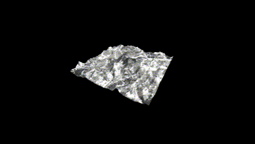
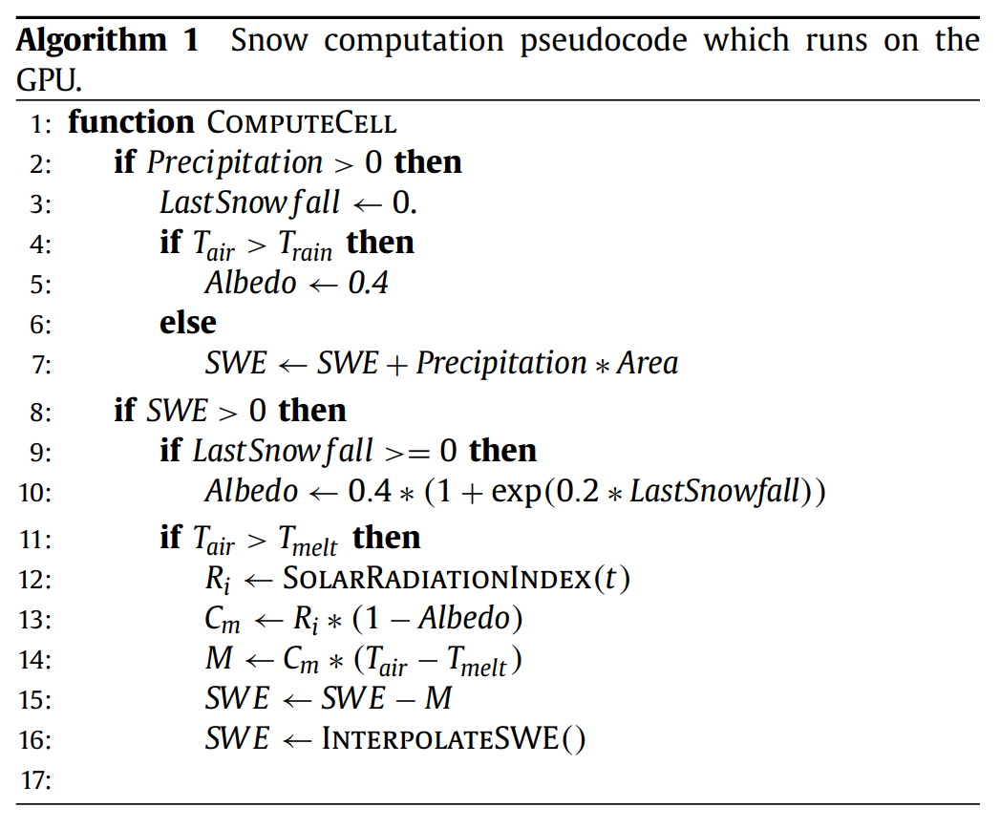

# Real-Time Snow Accumulation Simulation on Terrain in WebGPU

**University of Pennsylvania, CIS 565: GPU Programming and Architecture, Final Project**

by [Xiaoxiao Zou](), [Keyu Lu](), and [Jason Li]()).

## Installation
1. Clone this repo
2. Run `npm i`
3. Start with `npm start`
4. View the page in your browser!

## Usage
**Camera Controls**
- `Left Mouse`: change camera orientation
- `WASD`: move camera position
- `Space/Shift`: move camera up/down
- `resetCamera`: on the GUI, reset camera to the scene's default position

**Simulation Controls**
- `simulate`: start/stop simulation
- `deltaTime`: the time step to use in the simulation
- `temperature`: change the temperature to be used for weather simulation
- `precipitation`: change the precipitation to be used for weather simulation
- `use gui weather`: enable the use of weather parameters given in the gui for weather simulation

## Overview

This project implements a real-time snow accumulation simulation based on the paper: [Real-time GIS-based snow cover approximation and rendering for large terrains](https://www.sciencedirect.com/science/article/pii/S0097849317301693?fr=RR-2&ref=pdf_download&rr=821fc7e57b5d421b). The paper uses Unreal Engine as a basis for its simulation, but this project attempts to bring it to the mobile platform of the everyday browser using WebGPU as its framework for both simulation and rendering.

<!--  -->

## Pipeline
We use compute shaders written in WGSL for WebGPU to simulate our snow accumulation. The overall pipeline can be broken down into 5 stages:

1. **Terrain Grid Generation**: from a .tiff file with height data, generate a mesh with a uniform grid.
2. **Compute: Snow Fall**: Using simulated precipitation data, a snow-water equivalent (SWE) is calculated per cell
3. **Compute: Snow Melt**: The degree-day method is used to simulate melting of snow independently for each terrain cell.
4. **Compute: Snow Redistribution**: For each terrain cell, redistribute accumulated snow to neighboring cells using inclination data.
5. **Terrain & Snow Rendering**: Output a color and displacement map from the compute pipeline to be rendered over the terrain.

## Snow Accumulation Simulation
To ensure efficiency of the snow accumulation simulation, a uniform grid over the terrain is used for computation, and snow values are calculated independently using a compute pipeline for each grid cell. 

### Terrain Grid Implementation
We create a terrain mesh using data from uploaded .tiff files (uploading coming soon), and use this mesh to create uniform terrain cells over the terrain for snow simulation. Physically-based parameters for each terrain cell such as inclination and aspect are then pre-processed and calculated for use further down in the pipeline for our accumulation simulation. A matching texture to the .tiff file is also used to render terrain.

### Compute Shader: Snow Accumulation
Using physically-based variables such as inclination, aspect, temperature, and precipitation data, our compute pipeline runs the three stages of snow accumulation described above: snow fall, snow melt, and snow redistribution. 

For each terrain cell, a snow-water equivalent (SWE), which represents the amount of water contained in the snowpack per unit area, is calculated, and this value represents the amount of snow output from our compute pipeline. This SWE value is modified through physically-based parameters such as weather data for the snow fall stage and solar radiation for the snow melt stage. After these two stages, we then calculate the redistribution of snow between cells using terrain inclination and curvature for our final SWE output. This final step approximates physical behavior such as snow depletion on mountain tops and snow accumulation in gullies. The compute stage of our pipeline outputs a displacement and color map to be used in our snow rendering. 

### Terrain & Snow Rendering
Using our displacement and color map output from the compute shader, we interpolate between the texture of the terrain given from our GeoTIFF data and our snow data. A displacement map is used to simulate the appearance of snow rising and disappearing throughout the seasons of our simulation, and can be used to visualize the differences in snow accumulation between different types of terrain. In addition, a skybox is rendered behind our terrain to enhance the visual appearance and atmosphere of our scene.

### Performance Notes
Coming Soon!

## Future Work & References

### Future Work to be completed:
- Higher resolution snow simulation
- Importing of .tiff files and weather data
- Merging of all pipeline components

### References:
- [Real-time GIS-based snow cover approximation and rendering for large terrains](https://www.sciencedirect.com/science/article/pii/S0097849317301693?fr=RR-2&ref=pdf_download&rr=821fc7e57b5d421b)
- Base code from [WebGPU Samples](https://webgpu.github.io/webgpu-samples)
- [dat-gui](https://github.com/dataarts/dat.gui) for gui controls
- [WebGPU documentation](https://www.w3.org/TR/webgpu/)
